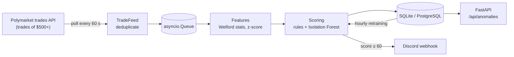

# Polymarket Insider

Flags statistically unusual large trades on [Polymarket](https://polymarket.com), the prediction market, a few minutes after they happen.

On a prediction market, someone who already knows how an event will turn out can profit by betting before the news is public. That kind of trade tends to leave a footprint: a large bet from a wallet with no history, or a bet far bigger than the wallet usually makes. This project watches every Polymarket trade of $500 or more, scores how unusual it is from 0 to 100, stores everything, and sends an alert when a trade stands out. It flags *unusual* trades for a human to look at. It cannot prove that anyone traded on inside information.

## Demo

Startup of a real run on 28 September 2026. The feed loads recent history, the model trains as soon as there are 1,000 trades, and then live trades keep arriving:

```text
22:24:33 main - Starting Polymarket trade monitor
22:24:33 trade_feed - Polling https://data-api.polymarket.com/trades every 60s for trades of $500 or more
22:24:33 main - Waiting for 1000 trades before training the model (have 0)
22:24:34 trade_feed - Backfilled 5000 trades of $500 or more
22:24:38 main - Processed 1000 trades | flagged 0 | queue 4000 | gaps 0 | model trained on 0
...
22:25:34 main - Trained Isolation Forest on 4959 trades
22:30:06 main - Processed 5000 trades | flagged 0 | queue 28 | gaps 0 | model trained on 4959
```

Summary of the same run from `scripts/run_stats.py`:

```text
Trades stored:          5,382 (1,446 wallets)
  from startup backfill 4,964 (covering 6.1 h before start)
  picked up live        418
Detection delay (min):  median 3.6, p90 5.6, max 6.7
Live scores:            p50 0.0, p90 14.3, p99 49.0, max 59.0
  score > 0             25.4%
Flagged (score >= 60):  0
```

<!-- Add a screenshot of a Discord alert here, e.g. docs/alert.png -->

## How it works



1. **Ingestion** (`src/ingestion/trade_feed.py`). Polymarket's public trades API needs no key but is cached for five minutes, so polling it for *all* trades would only ever see a thin sample. Instead the feed asks for trades above $500 using the API's cash filter. One page of those covers well over five minutes, so consecutive pages overlap and nothing is missed. On startup it loads the most recent 5,000 large trades (roughly six hours) so wallet history and the model have data from the start. Each trade goes into an `asyncio.Queue`, which decouples fetching from processing.
2. **Features** (`src/features/feature_engineer.py`). For each wallet the database keeps a running trade count, mean and variance of trade size, updated with [Welford's online algorithm](https://en.wikipedia.org/wiki/Algorithms_for_calculating_variance#Welford's_online_algorithm) so past trades never have to be reloaded. Each new trade gets a z-score: how many standard deviations it is above the wallet's *previous* average.
3. **Scoring** (`src/models/anomaly_detector.py`). Two rules and one model add points:

   | Signal | Points | When |
   |---|---|---|
   | Large first trade | 40 | The first trade this instance sees from a wallet is above $10,000 |
   | Size spike | 30 | The trade is more than 3 standard deviations above the wallet's previous average (needs 2+ earlier trades) |
   | Isolation Forest | 0 to 30 | The model finds the trade unusual across size, wallet history and z-score |

   A trade is flagged at 60 or more, so at least one rule and the model have to agree. The [Isolation Forest](https://scikit-learn.org/stable/modules/outlier_detection.html#isolation-forest) is unsupervised, which matters here because there is no labelled list of insider trades to learn from. It is retrained every hour on the latest 50,000 stored trades, and first as soon as 1,000 trades exist.
4. **Output**. Trades, wallet stats and flags are stored with SQLAlchemy (SQLite by default, PostgreSQL supported). Flags go to a Discord webhook if one is configured, and a small FastAPI app serves the most recent flags and the most-flagged wallets.

## Tech stack

Python 3.11+, asyncio, httpx, scikit-learn, NumPy, SQLAlchemy, SQLite / PostgreSQL, FastAPI, Uvicorn, pydantic-settings, pytest, ruff, uv.

## Getting started

You need Python 3.11 or newer and [uv](https://docs.astral.sh/uv/). No API key is required.

```bash
git clone https://github.com/rwondo/polymarket-insider.git
cd polymarket-insider
uv sync
uv run python main.py
```

The monitor logs progress every 1,000 trades and writes to `polymarket_insider.db`. To browse the results, start the API in a second terminal and open http://127.0.0.1:8000/docs:

```bash
uv run uvicorn src.api.main:app
```

Run the tests (offline, no network needed):

```bash
uv run pytest
```

Without uv, the pinned `requirements.txt` works with pip:

```bash
python -m venv .venv
source .venv/bin/activate        # Windows: .venv\Scripts\activate
pip install -r requirements.txt
python main.py
```

### Configuration

Copy `.env.example` to `.env` to change settings. All are optional.

| Variable | Default | Meaning |
|---|---|---|
| `WEBHOOK_URL` | empty | Discord webhook for flagged trades |
| `DATABASE_URL` | `sqlite:///polymarket_insider.db` | Any SQLAlchemy URL, e.g. PostgreSQL |
| `MIN_TRADE_USD` | 500 | Smallest trade the feed asks for |
| `ANOMALY_THRESHOLD` | 60 | Score at which a trade is flagged |
| `LARGE_TRADE_USD` | 10000 | Size that makes a first trade "large" |
| `BACKFILL_TRADES` | 5000 | Recent trades loaded on startup (0 to skip) |
| `RETRAIN_INTERVAL_SECONDS` | 3600 | How often the model is retrained |

A `Dockerfile` and `docker-compose.yml` (PostgreSQL plus the app) are included. They have not been tested in this version.

## Results

**Method.** One run with the default settings (trades of $500+, flag threshold 60, SQLite) on 28 September 2026 from 20:24 to 20:50 UTC. It was planned for an hour but stopped after 26 minutes when the machine ran low on memory. The numbers come from `uv run python scripts/run_stats.py --since "2026-09-28 20:24:31"`. Trades timestamped before the start came from the startup backfill; the rest were picked up live.

**What happened**

- **Volume.** 5,382 trades from 1,446 wallets were stored: 4,964 from the backfill (covering the 6.1 hours before the start) and 418 live. The live trades span 24.7 minutes, which is about 17 trades of $500 or more per minute.
- **Delay.** Live trades were stored a median of 3.6 minutes after they happened (maximum 6.7). That is the API's 5-minute cache plus the 60-second poll.
- **Coverage.** No gaps were detected: every poll overlapped the previous one. Two polls failed during a brief network outage on the test machine, and the next poll caught up.
- **Model.** The Isolation Forest first trained about a minute after startup, on 4,959 trades.
- **Scores.** 74.6% of live trades scored 0. Of the 418 live trades, 30 triggered the size-spike rule, 1 triggered the large-first-trade rule and 89 got points from the model. Eight scored 40 or more, the highest scored 59.0, and **nothing crossed the threshold of 60**.

**What the run showed**

- **The highest-scoring trades were all on sports markets.** Three of the top four were trades at a price of $0.996 to $0.999, i.e. on outcomes the market already treated as certain (for example a $21,199 buy of "Over 0.5 goals" in a football match at $0.999). These are large in dollars but carry almost no information. Ignoring trades priced at $0.99 or more is the obvious next step.
- **It exposed a bug.** One wallet's two earlier trades were both $500 up to float noise ($499.99999995 and $500.00000002). That left a variance of about 1e-15, and the next trade got a z-score of about 85 billion. The standard deviation is now floored at $1; this run predates that fix. The run also revealed that overlapping backfill pages could queue a trade twice. The database's unique key caught it, and the feed now drops such duplicates itself.

**Caveats.** This is 26 minutes on one evening, so it says nothing about how often alerts fire in general. The threshold and point values were not tuned. Without labelled insider trades, the flag rate cannot be turned into an accuracy figure.

## Limitations

- **No ground truth.** Nobody publishes a list of confirmed insider trades, so there is no way to measure precision or recall. A flag means "statistically unusual", not "insider".
- **"New wallet" means new to this database**, not new to Polymarket: any wallet whose last trade of $500+ happened before the backfill window (about six hours before the first start) looks new. The backfill softens this cold-start effect but does not remove it.
- **Only trades of $500 or more** are seen, so a wallet's history and z-score reflect its large trades only.
- **A few minutes behind real time**, because the API is cached for five minutes.
- **Hand-picked thresholds.** The point values, the $10,000 cut-off and the flag threshold are judgement calls, not tuned values.
- **The all-trades webhook** (`ALL_TRADES_WEBHOOK_URL`) will run into Discord's rate limits at Polymarket's volume.
- **No database migrations.** After a schema change, delete the SQLite file.

This is a prototype built to explore the problem, not a finished monitoring service.

## Project structure

```text
main.py                          pipeline: queue processor, scoring, retraining
src/
  config.py                      settings (environment variables / .env)
  ingestion/trade_feed.py        polls the trades API, deduplicates, backfills
  features/feature_engineer.py   Welford running stats and z-score
  models/anomaly_detector.py     rules + Isolation Forest scoring
  db/                            SQLAlchemy engine and models
  notifier/webhook.py            Discord alerts
  api/main.py                    FastAPI endpoints
scripts/run_stats.py             summary of a run (used for the Results section)
tests/                           offline tests for every stage
```

## License

MIT
